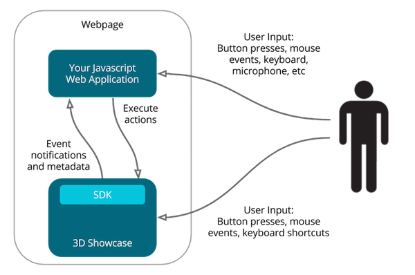
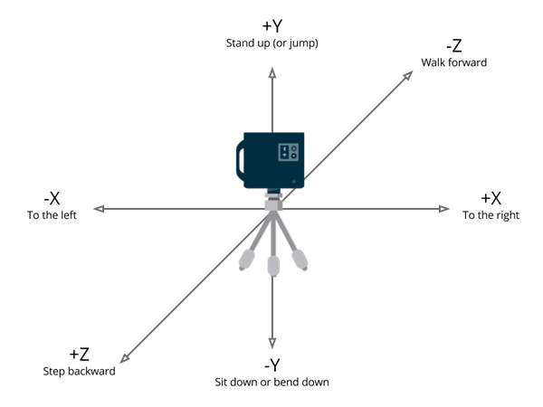
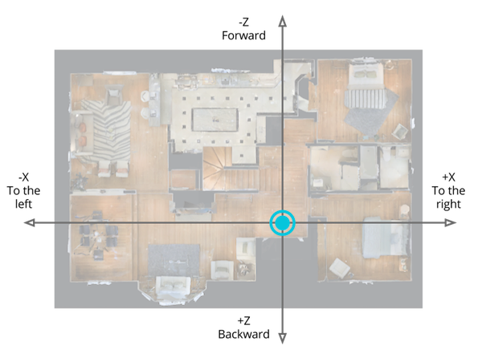
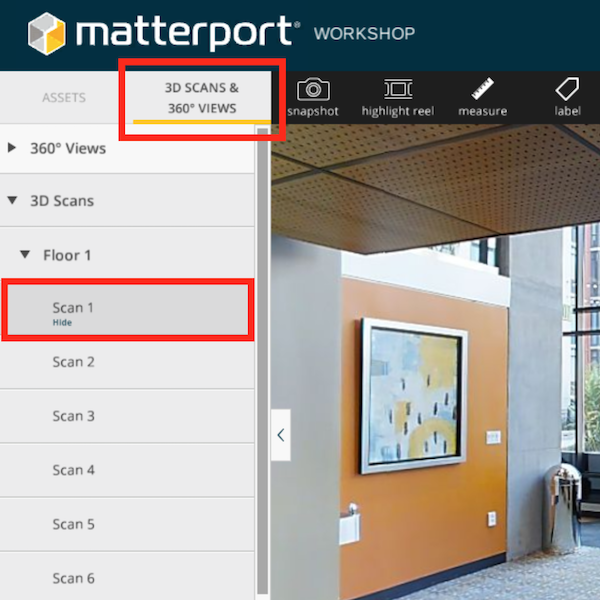

# Concepts

## Introduction

With the Matterport 3D Showcase SDK, your web application (web app) can **execute actions** that change where the end user is and what they see in 3D Showcase.

You can also let end users explore spaces with 3D Showcase naturally. Your web app can **listen to events** about where the user is and what they are seeing or doing, and then react appropriately.

Your web app can **both** execute actions and listen to events. Depending on the purpose of your web app, you will typically only do one or the other.

Finally, you can also use metadata about the entire Matterport Space so your web app can make informed decisions about the entire space.

   
  <em>Simple Message Flow with the 3D Showcase SDK</em>

If you’re having problems running 3D Showcase, it may be a problem with WebGL. Review our <a href="https://support.matterport.com/hc/articles/208220058">system requirements</a> for 3D Showcase.

## Coordinate Conventions

X, Y, and Z coordinates are from the **viewpoint of the Matterport camera** when it scanned the environment.

To make it easier to visualize, pretend the Matterport camera is a “human” and the Matterport camera lenses are his or her “eyes.” The buttons on the back of the Matterport Camera back are like the back of a person’s head.

Then, coordinate conventions are easier to describe relative to how the imaginary 'camera-person' moves:

   

This diagram is shown relative to the camera’s current position.

Another way to visualize the coordinate system is from the Floorplan View. This is the same as a “birds-eye” top-down view.

   

The floorplan is an absolute position of the Matterport Camera within the Space when it scanned.

The orientation of the Floorplan View depends on the original orientation of the pano that you transitioned from and the aspect ratio of the window.

The coordinate system is centered around the **first pano that was scanned**. This may be different from your Start Position.

To find the first scan, find the space in [my.matterport.com](https://my.matterport.com) and then launch Workshop.

   

Open the **3D Scans & 360º Views** menu. **Double click on Scan 1** and you will be transported to that scan position.

## [Return to the main page](index.md)
